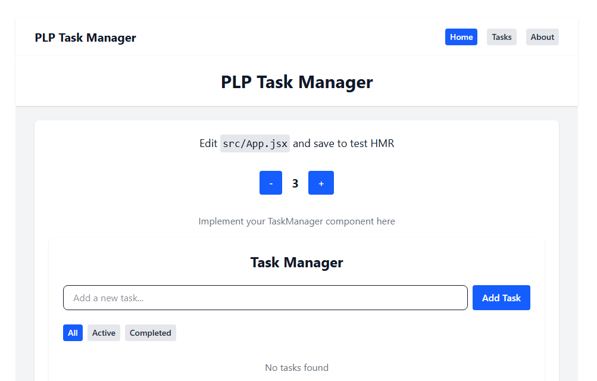

# 🧩 PLP Task Manager — React + Vite + Tailwind

A simple and elegant task management web app built with **React**, **Vite**, and **Tailwind CSS**.  
This project demonstrates key front-end development concepts such as component structuring, API fetching, dynamic state management, and modern UI styling.

---

## 🚀 Live Demo

🔗 **View the deployed site here:**  
👉 [https://plp-mern-stack-development.github.io/react-js-jsx-and-css-mastering-front-end-development-Ngaukon/](https://plp-mern-stack-development.github.io/react-js-jsx-and-css-mastering-front-end-development-Ngaukon/)

---

## 🖼️ Screenshots

### 🏠 Home Page



---

## 🛠️ Tech Stack

- ⚛️ **React 19**
- ⚡ **Vite 7**
- 🎨 **Tailwind CSS 4**
- 🌐 **Fetch API** for data loading
- 🚀 **GitHub Pages** for deployment

---

## ⚙️ Installation and Setup

Clone the repository and install dependencies:

```bash
git clone https://github.com/plp-mern-stack-development/react-js-jsx-and-css-mastering-front-end-development-Ngaukon.git
cd react-js-jsx-and-css-mastering-front-end-development-Ngaukon
npm install
````

Run the app locally:

```bash
npm run dev
```

Build for production:

```bash
npm run build
```

Deploy to GitHub Pages:

```bash
npm run deploy
```

---

## 🧠 Features

* 🔹 Responsive layout with dark mode support
* 🔹 Task management (add, edit, delete)
* 🔹 Counter functionality
* 🔹 Fetches sample data from JSONPlaceholder API
* 🔹 Modular components (Navbar, Button, Footer, Card, TaskManager)

---

## 👨‍💻 Author
💼 [https://github.com/Ngaukon](https://github.com/Ngaukon)

---

## 📄 License

This project is licensed under the **MIT License** — feel free to use and adapt it for learning purposes.

---

⭐ *If you found this helpful, give it a star on GitHub!*

```

---